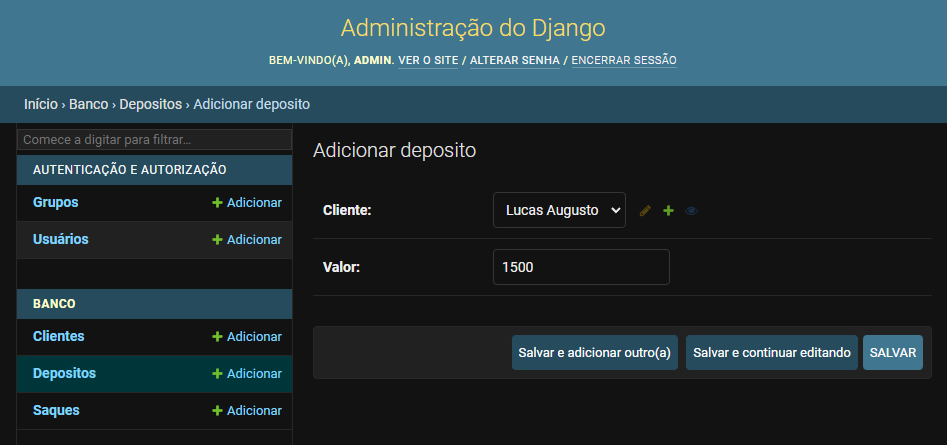

Banco API Django - incompleto

> Descrição:

Realizar operações de saque e depósito em conta. O código está incompleto e não possuo todas as funcionalidades **precisa de revisão** (primeira vez usando Django).

> Visão parcial:

<div style="text-align: center">
  
</div>


> Para rodar:

```
pip install -r requirements.txt
```

```
python manage.py runserver
```

Login: admin
Senha: admin